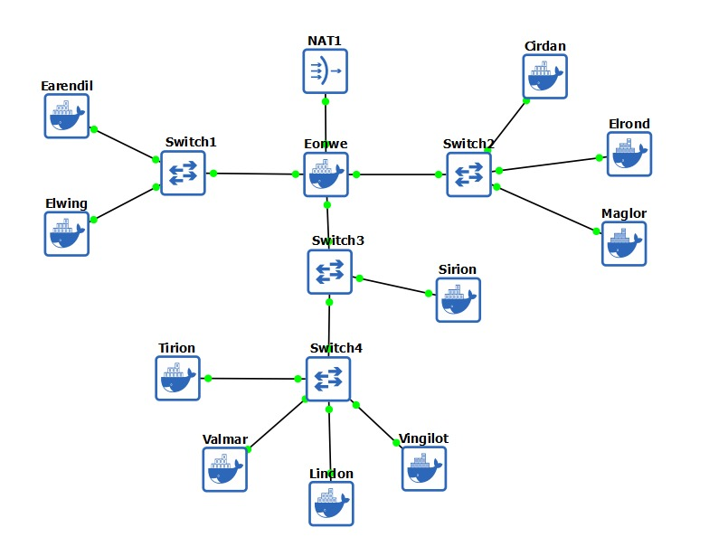
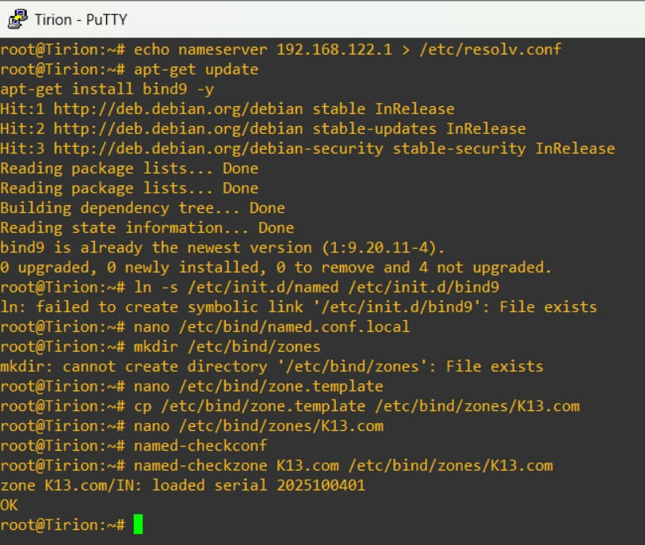
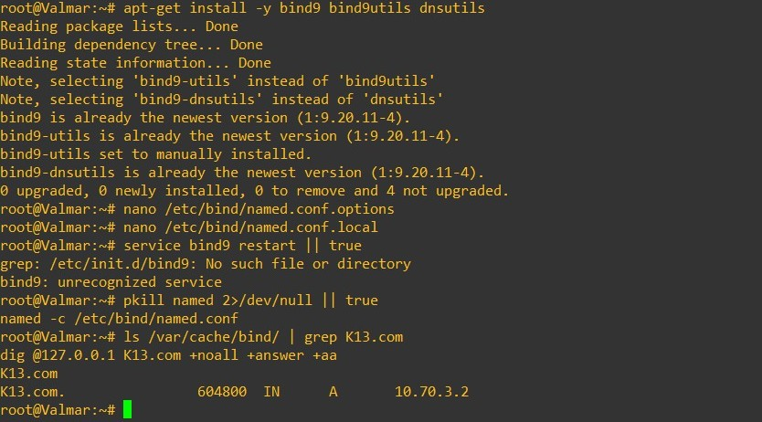
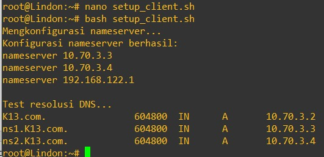
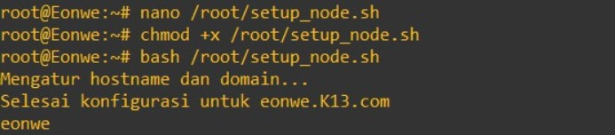
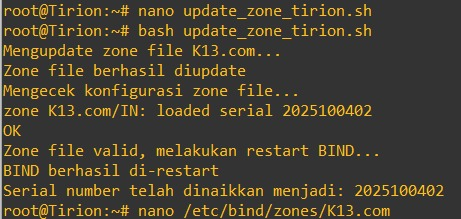
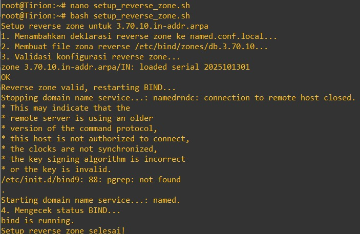
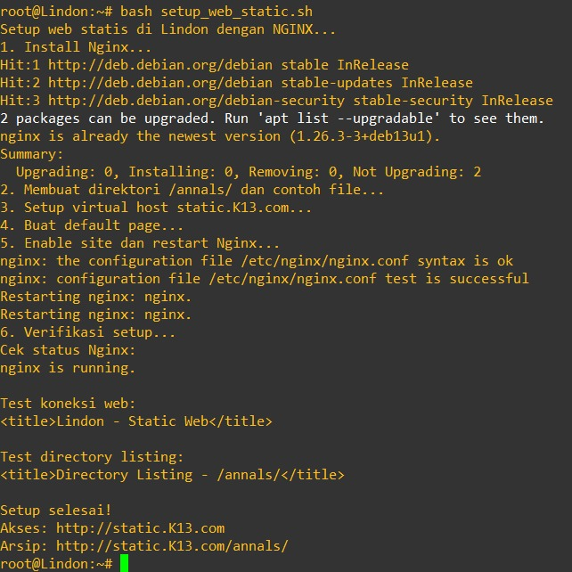

# Jarkom-Modul-2-2025-K-13

| Nama                   | NRP        |
|-------------------------|------------|
| Ahmad Rabbani Fata     | 5027241046 |
| Maritza Adelia Sucipto | 5027241111 |

Soal 1 - 10
1.	Di tepi Beleriand yang porak-poranda, Eonwe merentangkan tiga jalur: Barat untuk Earendil dan Elwing, Timur untuk Círdan, Elrond, Maglor, serta pelabuhan DMZ bagi Sirion, Tirion, Valmar, Lindon, Vingilot. Tetapkan alamat dan default gateway tiap tokoh sesuai glosarium yang sudah diberikan.

   
   
```bash
Eonwe:

auto eth0
iface eth0 inet dhcp

auto eth1  
iface eth1 inet static
address 10.70.1.1
netmask 255.255.255.0

auto eth2
iface eth2 inet static
address 10.70.2.1
netmask 255.255.255.0

auto eth3
iface eth3 inet static
address 10.70.3.1
netmask 255.255.255.0

Earendil:

auto eth0
iface eth0 inet static
address 10.70.1.2
netmask 255.255.255.0
gateway 10.70.1.1

elwing:

auto eth0
iface eth0 inet static
address 10.70.1.3
netmask 255.255.255.0
gateway 10.70.1.1

Tirion:

auto eth0
iface eth0 inet static
address 10.70.3.3
netmask 255.255.255.0
gateway 10.70.3.1

Valmar:

auto eth0
iface eth0 inet static
address 10.70.3.4
netmask 255.255.255.0
gateway 10.70.3.1

Lindon:

auto eth0
iface eth0 inet static
address 10.70.3.5
netmask 255.255.255.0
gateway 10.70.3.1

Vingilot:

auto eth0
iface eth0 inet static
address 10.70.3.6
netmask 255.255.255.0
gateway 10.70.3.1

Cirdan:

auto eth0
iface eth0 inet static
address 10.70.2.2
netmask 255.255.255.0
gateway 10.70.2.1

Erlond:

auto eth0
iface eth0 inet static
address 10.70.2.3
netmask 255.255.255.0
gateway 10.70.2.1

Maglor:

auto eth0
iface eth0 inet static
address 10.70.2.4
netmask 255.255.255.0
gateway 10.70.2.1

Sirion:

auto eth0
iface eth0 inet static
address 10.70.3.2
netmask 255.255.255.0
gateway 10.70.3.1
```

2. Angin dari luar mulai berhembus ketika Eonwe membuka jalan ke awan NAT. Pastikan jalur WAN di router aktif dan NAT meneruskan trafik keluar bagi seluruh alamat internal sehingga host di dalam dapat mencapai layanan di luar menggunakan IP address.
di Eonwe:
install iptables:
```bash
apt update && apt install -y iptables
```
Menambahkan aturan NAT:
```
iptables -t nat -A POSTROUTING -o eth0 -j MASQUERADE -s 10.70.0.0/16
```
cek konfigurasi:
```
cat /etc/resolv.conf
```

di semua node selain router:
```bash
echo nameserver 192.168.122.1 > /etc/resolv.conf
```
uji konektivitas internet:
```
ping google.com
```

3.	Kabar dari Barat menyapa Timur. Pastikan kelima klien dapat saling berkomunikasi lintas jalur (routing internal via Eonwe berfungsi), lalu pastikan setiap host non-router menambahkan resolver 192.168.122.1 saat interfacenya aktif agar akses paket dari internet tersedia sejak awal.

```bash
nano /root/.bashrc
```

isinya:
```bash
# ~/.bashrc: executed by bash(1) for non-login shells.

# Note: PS1 is set in /etc/profile, and the default umask is defined in /etc/login.defs. You should not need this unless you want different defaults
# for root. PS1='${debian_chroot:+($debian_chroot)}\h:\w\$ ' umask 022

# You may uncomment the following lines if you want `ls' to be colorized: export LS_OPTIONS='--color=auto' eval "$(dircolors)" alias ls='ls
# $LS_OPTIONS' alias ll='ls $LS_OPTIONS -l' alias l='ls $LS_OPTIONS -lA'
# Note: PS1 is set in /etc/profile, and the default umask is defined
#
# Some more alias to avoid making mistakes: alias rm='rm -i' alias cp='cp -i' alias mv='mv -i'
# in /etc/login.defs. You should not need this unless you want different
# defaults for root.
# PS1='${debian_chroot:+($debian_chroot)} \h:\w\$

# umask 022

# You may uncomment the following lines if you want 'ls' to be colorized:
# export LS_OPTIONS='--color=auto'
# eval "$(dircolors)"
# alias ls='ls $LS_OPTIONS'
# alias ll='ls $LS_OPTIONS -l'
# alias lr='ls $LS_OPTIONS -lA'
#


# Some more alias to avoid making mistakes:
# alias rm='rm -i'
# alias cpr='cp -i'
# alias mv='mv -i'

iptables -t nat -A POSTROUTING -o eth0 -j MASQUERADE -s 10.70.0.0/16
echo nameserver 192.168.122.1 > /etc/resolv.conf

```

4.	Para penjaga nama naik ke menara, di Tirion (ns1/master) bangun zona <xxxx>.com sebagai authoritative dengan SOA yang menunjuk ke ns1.<xxxx>.com dan catatan NS untuk ns1.<xxxx>.com dan ns2.<xxxx>.com. Buat A record untuk ns1.<xxxx>.com dan ns2.<xxxx>.com yang mengarah ke alamat Tirion dan Valmar sesuai glosarium, serta A record apex <xxxx>.com yang mengarah ke alamat Sirion (front door), aktifkan notify dan allow-transfer ke Valmar, set forwarders ke 192.168.122.1. Di Valmar (ns2/slave) tarik zona <xxxx>.com dari Tirion dan pastikan menjawab authoritative. pada seluruh host non-router ubah urutan resolver menjadi IP dari ns1.<xxxx>.com → ns2.<xxxx>.com → 192.168.122.1. Verifikasi query ke apex dan hostname layanan dalam zona dijawab melalui ns1/ns2.

### Tirion:



buat file ```setup_ns1_tirion.sh```

```bash
#!/bin/sh
set -e

# Install BIND
apt-get update
apt-get install -y bind9 dnsutils

# symlink init script kalau belum ada
[ -e /etc/init.d/bind9 ] || ln -s /etc/init.d/named /etc/init.d/bind9 || true

# Pastikan direktori zona ada
mkdir -p /etc/bind/zones

# named.conf.options: listen & forwarders
cat >/etc/bind/named.conf.options <<'EOF'
options {
    directory "/var/cache/bind";

    recursion yes;
    allow-query { any; };

    listen-on { any; };
    listen-on-v6 { any; };

    forwarders { 192.168.122.1; };

    dnssec-validation no;
    auth-nxdomain no;
};
EOF

# named.conf.local: definisi zona master K13.com
cat >/etc/bind/named.conf.local <<'EOF'
zone "K13.com" {
    type master;
    file "/etc/bind/zones/K13.com";
    allow-transfer { 10.70.3.4; };   // Valmar (ns2)
    also-notify   { 10.70.3.4; };
    notify yes;
};
EOF

# File zona forward K13.com (SOA ke ns1, NS ns1 & ns2, A records)
cat >/etc/bind/zones/K13.com <<'EOF'
$TTL    604800
@       IN      SOA     ns1.K13.com. root.K13.com. (
                        2025100401      ; Serial (YYYYMMDDnn) → NAIKKAN jika mengubah file ini
                        604800          ; Refresh
                        86400           ; Retry
                        2419200         ; Expire
                        604800 )        ; Neg TTL
;

@       IN      NS      ns1.K13.com.
@       IN      NS      ns2.K13.com.

; A records
ns1     IN      A       10.70.3.3       ; Tirion (master)
ns2     IN      A       10.70.3.4       ; Valmar (slave)
@       IN      A       10.70.3.2       ; Apex → Sirion (front door)
EOF

# Cek sintaks
named-checkconf -z
named-checkzone K13.com /etc/bind/zones/K13.com

# Start/Restart named
pkill named 2>/dev/null || true
named -c /etc/bind/named.conf

# Verifikasi cepat
echo "== dig SOA @ns1 =="
dig -4 @127.0.0.1 K13.com SOA +noall +answer
echo "== dig A ns1/ns2/apex =="
dig -4 @127.0.0.1 ns1.K13.com +short
dig -4 @127.0.0.1 ns2.K13.com +short
dig -4 @127.0.0.1 K13.com +short

echo "NS1 (Tirion) ready."
```
lalu jalankan dengan:
```bash
bash setup_ns1_tirion.sh
```
### Valmar:



Konfigurasi ini membuat BIND bertindak sebagai DNS resolver:

```bash
apt-get update
apt-get install -y bind9 bind9utils dnsutils
```
```
nano /etc/bind/named.conf.options
```

isi:
```bash
options {
        directory "/var/cache/bind";

        listen-on { any; };
        listen-on-v6 { any; };

        allow-query { any; };
        recursion yes;

        forwarders { 192.168.122.1; };
        forward only;

        dnssec-validation no;

        auth-nxdomain no;
};
```
Lalu validasi & jalankan:
```bash
named-checkconf
named -g -c /etc/bind/named.conf
pkill named 2>/dev/null || true # pastikan tidak ada proses lama
named -c /etc/bind/named.conf & # start di background
```
Tes dari Valmar (ns2)
```bash
dig @127.0.0.1 K13.com +noall +answer +aa
dig @10.70.3.4 K13.com +noall +answer +aa
dig @10.70.3.4 -x 10.70.3.2 +noall +answer +aa

```
```
nano /etc/bind/named.conf.local 
```
isi:
```bash
zone "K13.com" {
    type slave;
    file "/var/cache/bind/K13.com";    // copy zona di ns2
    masters { 10.70.3.3; };           // Tirion (ns1)
    allow-notify { 10.70.3.3; };
};

```
```bash
pkill named 2>/dev/null || true
named -c /etc/bind/named.conf
```
Lalu jalankan:
```bash
ls /var/cache/bind/ | grep K13.com
dig @127.0.0.1 K13.com +noall +answer +aa
```
harusnya muncul:
```
K13.com.                604800  IN      A       10.70.3.2
```

### Ke semua client non router



buat file ```setup_client.sh```
```bash
#!/bin/sh

# Script untuk mengkonfigurasi nameserver dan test dasar

echo "Mengkonfigurasi nameserver..."
cat > /etc/resolv.conf << EOF
nameserver 10.70.3.3
nameserver 10.70.3.4
nameserver 192.168.122.1
EOF

echo "Konfigurasi nameserver berhasil:"
cat /etc/resolv.conf

echo ""
echo "Test resolusi DNS..."
dig k13.com +noall +answer
dig ns1.k13.com +noall +answer
dig ns2.k13.com +noall +answer


```
buat file ```setup_ns2_valmar.sh```

```bash

```
5.	“Nama memberi arah,” kata Eonwe. Namai semua tokoh (hostname) sesuai glosarium, eonwe, earendil, elwing, cirdan, elrond, maglor, sirion, tirion, valmar, lindon, vingilot, dan verifikasi bahwa setiap host mengenali dan menggunakan hostname tersebut secara system-wide. Buat setiap domain untuk masing masing node sesuai dengan namanya (contoh: eru.<xxxx>.com) dan assign IP masing-masing juga. Lakukan pengecualian untuk node yang bertanggung jawab atas ns1 dan ns2

di semua node (Router juga) kecuali Tirion dan Valmar:



menyetel hostname, file hosts, dan resolver DNS secara otomatis pada tiap node (kecuali Tirion dan Valmar) agar semua perangkat di jaringan bisa saling mengenali lewat domain K13.com.

buat file sh
```
nano setup_node.sh 
```
isi file sesuai dengan nodenya

Jalankan:
```bash
bash setup_node.sh

```
isi file untuk tiap node
Eonwe:
```bash
#!/bin/bash
HOSTNAME="eonwe"
IPADDR="10.70.2.4"
DOMAIN="K13.com"

echo "Mengatur hostname dan domain..."
echo "$HOSTNAME" > /etc/hostname
hostname $HOSTNAME

cat > /etc/hosts <<EOF
127.0.0.1   localhost
$IPADDR     $HOSTNAME.$DOMAIN   $HOSTNAME

# DNS Servers
10.70.3.3   ns1.$DOMAIN   ns1
10.70.3.4   ns2.$DOMAIN   ns2

# Semua node lainnya
10.70.3.1   eonwe.$DOMAIN   eonwe
10.70.3.2   sirion.$DOMAIN  sirion
10.70.1.2   earendil.$DOMAIN earendil
10.70.1.3   elwing.$DOMAIN  elwing
10.70.2.2   cirdan.$DOMAIN  cirdan
10.70.2.3   elrond.$DOMAIN  elrond
10.70.2.4   maglor.$DOMAIN  maglor
10.70.3.5   lindon.$DOMAIN  lindon
10.70.3.6   vingilot.$DOMAIN vingilot
EOF

# Resolver DNS
echo "nameserver 10.70.3.3" > /etc/resolv.conf
echo "nameserver 10.70.3.4" >> /etc/resolv.conf
echo "nameserver 192.168.122.1" >> /etc/resolv.conf

echo "Selesai konfigurasi untuk $HOSTNAME.$DOMAIN"
echo "Hostname sekarang: $(hostname)"

```
Earendil:
```bash
#!/bin/bash
HOSTNAME="earendil"
IPADDR="10.70.1.2"
DOMAIN="K13.com"

echo "$HOSTNAME" > /etc/hostname
hostname $HOSTNAME

cat > /etc/hosts <<EOF
127.0.0.1 localhost
$IPADDR $HOSTNAME.$DOMAIN $HOSTNAME

10.70.3.3 ns1.$DOMAIN ns1
10.70.3.4 ns2.$DOMAIN ns2
10.70.3.1 eonwe.$DOMAIN eonwe
10.70.3.2 sirion.$DOMAIN sirion
10.70.1.2 earendil.$DOMAIN earendil
10.70.1.3 elwing.$DOMAIN elwing
10.70.2.2 cirdan.$DOMAIN cirdan
10.70.2.3 elrond.$DOMAIN elrond
10.70.2.4 maglor.$DOMAIN maglor
10.70.3.5 lindon.$DOMAIN lindon
10.70.3.6 vingilot.$DOMAIN vingilot
EOF

echo "nameserver 10.70.3.3" > /etc/resolv.conf
echo "nameserver 10.70.3.4" >> /etc/resolv.conf
echo "nameserver 192.168.122.1" >> /etc/resolv.conf

echo "Selesai konfigurasi untuk $HOSTNAME.$DOMAIN"
hostname
```

Elwing:
```bash
#!/bin/bash
HOSTNAME="elwing"
IPADDR="10.70.1.3"
DOMAIN="K13.com"

echo "$HOSTNAME" > /etc/hostname
hostname $HOSTNAME

cat > /etc/hosts <<EOF
127.0.0.1 localhost
$IPADDR $HOSTNAME.$DOMAIN $HOSTNAME

10.70.3.3 ns1.$DOMAIN ns1
10.70.3.4 ns2.$DOMAIN ns2
10.70.3.1 eonwe.$DOMAIN eonwe
10.70.3.2 sirion.$DOMAIN sirion
10.70.1.2 earendil.$DOMAIN earendil
10.70.1.3 elwing.$DOMAIN elwing
10.70.2.2 cirdan.$DOMAIN cirdan
10.70.2.3 elrond.$DOMAIN elrond
10.70.2.4 maglor.$DOMAIN maglor
10.70.3.5 lindon.$DOMAIN lindon
10.70.3.6 vingilot.$DOMAIN vingilot
EOF

echo "nameserver 10.70.3.3" > /etc/resolv.conf
echo "nameserver 10.70.3.4" >> /etc/resolv.conf
echo "nameserver 192.168.122.1" >> /etc/resolv.conf

echo "Selesai konfigurasi untuk $HOSTNAME.$DOMAIN"
hostname

```
Sirion:
```bash
#!/bin/bash
HOSTNAME="sirion"
IPADDR="10.70.3.2"
DOMAIN="K13.com"

echo "$HOSTNAME" > /etc/hostname
hostname $HOSTNAME

cat > /etc/hosts <<EOF
127.0.0.1 localhost
$IPADDR $HOSTNAME.$DOMAIN $HOSTNAME

10.70.3.3 ns1.$DOMAIN ns1
10.70.3.4 ns2.$DOMAIN ns2
10.70.3.1 eonwe.$DOMAIN eonwe
10.70.3.2 sirion.$DOMAIN sirion
10.70.1.2 earendil.$DOMAIN earendil
10.70.1.3 elwing.$DOMAIN elwing
10.70.2.2 cirdan.$DOMAIN cirdan
10.70.2.3 elrond.$DOMAIN elrond
10.70.2.4 maglor.$DOMAIN maglor
10.70.3.5 lindon.$DOMAIN lindon
10.70.3.6 vingilot.$DOMAIN vingilot
EOF

echo "nameserver 10.70.3.3" > /etc/resolv.conf
echo "nameserver 10.70.3.4" >> /etc/resolv.conf
echo "nameserver 192.168.122.1" >> /etc/resolv.conf

echo "Selesai konfigurasi untuk $HOSTNAME.$DOMAIN"
hostname

```

Cirdan:
```bash
#!/bin/bash
HOSTNAME="cirdan"
IPADDR="10.70.2.2"
DOMAIN="K13.com"

echo "$HOSTNAME" > /etc/hostname
hostname $HOSTNAME

cat > /etc/hosts <<EOF
127.0.0.1 localhost
$IPADDR $HOSTNAME.$DOMAIN $HOSTNAME

10.70.3.3 ns1.$DOMAIN ns1
10.70.3.4 ns2.$DOMAIN ns2
10.70.3.1 eonwe.$DOMAIN eonwe
10.70.3.2 sirion.$DOMAIN sirion
10.70.1.2 earendil.$DOMAIN earendil
10.70.1.3 elwing.$DOMAIN elwing
10.70.2.2 cirdan.$DOMAIN cirdan
10.70.2.3 elrond.$DOMAIN elrond
10.70.2.4 maglor.$DOMAIN maglor
10.70.3.5 lindon.$DOMAIN lindon
10.70.3.6 vingilot.$DOMAIN vingilot
EOF

echo "nameserver 10.70.3.3" > /etc/resolv.conf
echo "nameserver 10.70.3.4" >> /etc/resolv.conf
echo "nameserver 192.168.122.1" >> /etc/resolv.conf

echo "Selesai konfigurasi untuk $HOSTNAME.$DOMAIN"
hostname

```

Elrond:
```bash
#!/bin/bash
HOSTNAME="elrond"
IPADDR="10.70.2.3"
DOMAIN="K13.com"

echo "$HOSTNAME" > /etc/hostname
hostname $HOSTNAME

cat > /etc/hosts <<EOF
127.0.0.1 localhost
$IPADDR $HOSTNAME.$DOMAIN $HOSTNAME

10.70.3.3 ns1.$DOMAIN ns1
10.70.3.4 ns2.$DOMAIN ns2
10.70.3.1 eonwe.$DOMAIN eonwe
10.70.3.2 sirion.$DOMAIN sirion
10.70.1.2 earendil.$DOMAIN earendil
10.70.1.3 elwing.$DOMAIN elwing
10.70.2.2 cirdan.$DOMAIN cirdan
10.70.2.3 elrond.$DOMAIN elrond
10.70.2.4 maglor.$DOMAIN maglor
10.70.3.5 lindon.$DOMAIN lindon
10.70.3.6 vingilot.$DOMAIN vingilot
EOF

echo "nameserver 10.70.3.3" > /etc/resolv.conf
echo "nameserver 10.70.3.4" >> /etc/resolv.conf
echo "nameserver 192.168.122.1" >> /etc/resolv.conf

echo "Selesai konfigurasi untuk $HOSTNAME.$DOMAIN"
hostname

```
Maglor
```bash
#!/bin/bash
HOSTNAME="maglor"
IPADDR="10.70.2.4"
DOMAIN="K13.com"

echo "$HOSTNAME" > /etc/hostname
hostname $HOSTNAME

cat > /etc/hosts <<EOF
127.0.0.1 localhost
$IPADDR $HOSTNAME.$DOMAIN $HOSTNAME

10.70.3.3 ns1.$DOMAIN ns1
10.70.3.4 ns2.$DOMAIN ns2
10.70.3.1 eonwe.$DOMAIN eonwe
10.70.3.2 sirion.$DOMAIN sirion
10.70.1.2 earendil.$DOMAIN earendil
10.70.1.3 elwing.$DOMAIN elwing
10.70.2.2 cirdan.$DOMAIN cirdan
10.70.2.3 elrond.$DOMAIN elrond
10.70.2.4 maglor.$DOMAIN maglor
10.70.3.5 lindon.$DOMAIN lindon
10.70.3.6 vingilot.$DOMAIN vingilot
EOF

echo "nameserver 10.70.3.3" > /etc/resolv.conf
echo "nameserver 10.70.3.4" >> /etc/resolv.conf
echo "nameserver 192.168.122.1" >> /etc/resolv.conf

echo "Selesai konfigurasi untuk $HOSTNAME.$DOMAIN"
hostname
```
Lindon:
```bash
#!/bin/bash
HOSTNAME="lindon"
IPADDR="10.70.3.5"
DOMAIN="K13.com"

echo "$HOSTNAME" > /etc/hostname
hostname $HOSTNAME

cat > /etc/hosts <<EOF
127.0.0.1 localhost
$IPADDR $HOSTNAME.$DOMAIN $HOSTNAME

10.70.3.3 ns1.$DOMAIN ns1
10.70.3.4 ns2.$DOMAIN ns2
10.70.3.1 eonwe.$DOMAIN eonwe
10.70.3.2 sirion.$DOMAIN sirion
10.70.1.2 earendil.$DOMAIN earendil
10.70.1.3 elwing.$DOMAIN elwing
10.70.2.2 cirdan.$DOMAIN cirdan
10.70.2.3 elrond.$DOMAIN elrond
10.70.2.4 maglor.$DOMAIN maglor
10.70.3.5 lindon.$DOMAIN lindon
10.70.3.6 vingilot.$DOMAIN vingilot
EOF

echo "nameserver 10.70.3.3" > /etc/resolv.conf
echo "nameserver 10.70.3.4" >> /etc/resolv.conf
echo "nameserver 192.168.122.1" >> /etc/resolv.conf

echo "Selesai konfigurasi untuk $HOSTNAME.$DOMAIN"
hostname

```
Vingilot
```bash
#!/bin/bash
HOSTNAME="vingilot"
IPADDR="10.70.3.6"
DOMAIN="K13.com"

echo "$HOSTNAME" > /etc/hostname
hostname $HOSTNAME

cat > /etc/hosts <<EOF
127.0.0.1 localhost
$IPADDR $HOSTNAME.$DOMAIN $HOSTNAME

10.70.3.3 ns1.$DOMAIN ns1
10.70.3.4 ns2.$DOMAIN ns2
10.70.3.1 eonwe.$DOMAIN eonwe
10.70.3.2 sirion.$DOMAIN sirion
10.70.1.2 earendil.$DOMAIN earendil
10.70.1.3 elwing.$DOMAIN elwing
10.70.2.2 cirdan.$DOMAIN cirdan
10.70.2.3 elrond.$DOMAIN elrond
10.70.2.4 maglor.$DOMAIN maglor
10.70.3.5 lindon.$DOMAIN lindon
10.70.3.6 vingilot.$DOMAIN vingilot
EOF

echo "nameserver 10.70.3.3" > /etc/resolv.conf
echo "nameserver 10.70.3.4" >> /etc/resolv.conf
echo "nameserver 192.168.122.1" >> /etc/resolv.conf

echo "Selesai konfigurasi untuk $HOSTNAME.$DOMAIN"
hostname

```
Setelah semua jalanin, bisa di tes dengan:
```bash
ping -c3 ns1.K13.com
ping -c3 sirion.K13.com
ping -c3 earendil.K13.com

```

6.	Lonceng Valmar berdentang mengikuti irama Tirion. Pastikan zone transfer berjalan, Pastikan Valmar (ns2) telah menerima salinan zona terbaru dari Tirion (ns1). Nilai serial SOA di keduanya harus sama

di Valmar cek apakah zone transfer berhasil:
```
ls /var/cache/bind/
```
harus muncul ```file K13.com```

lalu cek serial-nya di Tirion dan Valmar:
```
dig @127.0.0.1 K13.com SOA +noall +answer
```
Outputnya:
```
K13.com.                604800  IN      SOA     ns1.K13.com. root.K13.com. 2025100401 604800 86400 2419200 604800
```

7.	Peta kota dan pelabuhan dilukis. Sirion sebagai gerbang, Lindon sebagai web statis, Vingilot sebagai web dinamis. Tambahkan pada zona <xxxx>.com A record untuk sirion.<xxxx>.com (IP Sirion), lindon.<xxxx>.com (IP Lindon), dan vingilot.<xxxx>.com (IP Vingilot). Tetapkan CNAME :
-	www.<xxxx>.com → sirion.<xxxx>.com, 
-	static.<xxxx>.com → lindon.<xxxx>.com, dan 
-	app.<xxxx>.com → vingilot.<xxxx>.com. 
Verifikasi dari dua klien berbeda bahwa seluruh hostname tersebut ter-resolve ke tujuan yang benar dan konsisten.

Tirion:



buat file ```update_zone_tirion.sh```
```bash
#!/bin/sh

# Script untuk update zone file K13.com dan restart BIND

echo "Mengupdate zone file K13.com..."

# Backup zone file terlebih dahulu
cp /etc/bind/zones/K13.com /etc/bind/zones/K13.com.backup.$(date +%Y%m%d_%H%M%S)

# Update zone file - pertahankan struktur awal dan tambahkan records baru
cat > /etc/bind/zones/K13.com << 'EOF'
$TTL    604800
@       IN      SOA     ns1.K13.com. root.K13.com. (
                        2025100402      ; Serial (YYYYMMDDnn) - Dinaikkan
                        604800          ; Refresh
                        86400           ; Retry
                        2419200         ; Expire
                        604800 )        ; Neg TTL
;

@       IN      NS      ns1.K13.com.
@       IN      NS      ns2.K13.com.

; A records
ns1     IN      A       10.70.3.3       ; Tirion (master)
ns2     IN      A       10.70.3.4       ; Valmar (slave)
@       IN      A       10.70.3.2       ; Apex mengarah ke Sirion (front door)

; Tambahan untuk web & gateway
sirion  IN A 10.70.3.2       ; Sirion (gateway / gerbang)
lindon  IN A 10.70.3.5       ; Lindon (web statis)
vingilot IN A 10.70.3.6      ; Vingilot (web dinamis)

; CNAME (alias)
www     IN CNAME sirion.K13.com.
static  IN CNAME lindon.K13.com.
app     IN CNAME vingilot.K13.com.
EOF

echo "Zone file berhasil diupdate"

echo "Mengecek konfigurasi zone file..."
named-checkzone K13.com /etc/bind/zones/K13.com

if [ $? -eq 0 ]; then
    echo "Zone file valid, melakukan restart BIND..."
    
    # Stop BIND jika sedang berjalan
    pkill named 2>/dev/null || true
    sleep 2
    
    # Start BIND
    named -c /etc/bind/named.conf
    
    echo "BIND berhasil di-restart"
    echo "Serial number telah dinaikkan menjadi: 2025100402"
else
    echo "ERROR: Zone file tidak valid, periksa kembali konfigurasi"
    exit 1
fi
```
### Valmar:

Restart Bind di Valmar
```bash
pkill named 2>/dev/null || true
named -c /etc/bind/named.conf
```
Lalu cek apakah file zona sudah ditransfer ulang di Valmar:
```
ls /var/cache/bind/
```

Verifikasi dari dua klien berbeda
misal Eardil dan Elwing
```bash
dig sirion.K13.com +short
dig lindon.K13.com +short
dig vingilot.K13.com +short

dig www.K13.com +short
dig static.K13.com +short
dig app.K13.com +short
```

Outputnya:
```
10.70.3.2
10.70.3.5
10.70.3.6
sirion.K13.com.
10.70.3.2
lindon.K13.com.
10.70.3.5
vingilot.K13.com.
10.70.3.6
```

8.	Setiap jejak harus bisa diikuti. Di Tirion (ns1) deklarasikan satu reverse zone untuk segmen DMZ tempat Sirion, Lindon, Vingilot berada. Di Valmar (ns2) tarik reverse zone tersebut sebagai slave, isi PTR untuk ketiga hostname itu agar pencarian balik IP address mengembalikan hostname yang benar, lalu pastikan query reverse untuk alamat Sirion, Lindon, Vingilot dijawab authoritative.

### Konfigurasi di Tirion (ns1 / master)



buat file ```setup_reverse_zone.sh```
```bash
#!/bin/sh
set -e

# Add reverse zone to named.conf.local
cat >> /etc/bind/named.conf.local <<'EOF'

zone "3.70.10.in-addr.arpa" {
    type master;
    file "/etc/bind/zones/db.3.70.10";
    notify yes;
    also-notify { 10.70.3.4; };
    allow-transfer { 10.70.3.4; };
};
EOF

# Create reverse zone file
mkdir -p /etc/bind/zones
cat > /etc/bind/zones/db.3.70.10 <<'EOF'
$TTL 604800
@   IN  SOA ns1.K13.com. root.K13.com. (
        2025101301 ; Serial
        3600       ; Refresh
        1800       ; Retry
        1209600    ; Expire
        86400 )    ; Negative Cache TTL
;

; Name Servers
@       IN  NS  ns1.K13.com.
@       IN  NS  ns2.K13.com.

; PTR Records
2   IN  PTR  sirion.K13.com.
5   IN  PTR  lindon.K13.com.
6   IN  PTR  vingilot.K13.com.
3   IN  PTR  ns1.K13.com.
4   IN  PTR  ns2.K13.com.
EOF

# Check zone syntax
named-checkzone 3.70.10.in-addr.arpa /etc/bind/zones/db.3.70.10

# Restart BIND
pkill named 2>/dev/null || true
named -c /etc/bind/named.conf

# Verify reverse lookup
dig @127.0.0.1 -x 10.70.3.2 +short
dig @127.0.0.1 -x 10.70.3.5 +short
dig @127.0.0.1 -x 10.70.3.6 +short

echo "Reverse zone setup completed"
```

Deklarasi reverse zone di /etc/bind/named.conf.local
Tambahkan di bawah zona K13.com:
```bash
zone "3.70.10.in-addr.arpa" {
    type master;
    file "/etc/bind/zones/db.3.70.10";
    notify yes;
    also-notify { 10.70.3.4; };
    allow-transfer { 10.70.3.4; };
};
```

lalu Buat file zona reverse /etc/bind/zones/db.3.70.10
```bash
$TTL 604800
@   IN  SOA ns1.K13.com. root.K13.com. (
        2025101301 ; Serial
        3600       ; Refresh
        1800       ; Retry
        1209600    ; Expire
        86400 )    ; Negative Cache TTL
;

; Name Servers
@       IN  NS  ns1.K13.com.
@       IN  NS  ns2.K13.com.

; PTR Records
2   IN  PTR  Sirion.K13.com.
5   IN  PTR  Lindon.K13.com.
6   IN  PTR  Vingilot.K13.com.
3   IN  PTR  ns1.K13.com.
4   IN  PTR  ns2.K13.com.
```
Cek & reload BIND
```bash
named-checkzone 3.70.10.in-addr.arpa /etc/bind/zones/db.3.70.10
service bind9 restart
service bind9 status
```

### Konfigurasi di Valmar (ns2 / slave)
Tambahkan zona slave di ```/etc/bind/named.conf.local```

```bash
zone "3.70.10.in-addr.arpa" {
    type slave;
    file "/var/cache/bind/db.3.70.10";
    masters { 10.70.3.3; };
    allow-notify { 10.70.3.3; };
};
```
Reload BIND
```
pkill named 2>/dev/null || true
named -c /etc/bind/named.conf
```
Cek zone transfer di Valmar
```bash
ls -l /var/cache/bind/ # harus ada: K13.com  dan  db.10.70.3 
```
Tes query di Valmar
```
dig -4 @127.0.0.1 K13.com SOA +noall +answer +aa
dig -4 @127.0.0.1 sirion.K13.com +short
dig -4 @127.0.0.1 -x 10.70.3.2 +short
```
Tes dari klien lain (Earendil / Elwing)
```
dig K13.com +short
dig sirion.K13.com +short
dig static.K13.com +short
dig app.K13.com +short
dig -x 10.70.3.2 +short
dig -x 10.70.3.5 +short
dig -x 10.70.3.6 +short
```
Cek sinkronisasi serial

pastikan nilai Serial SOA di Tirion dan Valmar sama:
```
dig -4 @10.70.3.3 K13.com SOA +short
dig -4 @10.70.3.4 K13.com SOA +short
```

9.	Lampion Lindon dinyalakan. Jalankan web statis pada hostname static.<xxxx>.com dan buka folder arsip /annals/ dengan autoindex (directory listing) sehingga isinya dapat ditelusuri. Akses harus dilakukan melalui hostname, bukan IP.

### Lindon

buat file ```setup_web_static.sh```
```bash
#!/bin/sh

# Script untuk setup web statis di Lindon dengan NGINX
# Hostname: static.K13.com | Folder: /annals/ dengan autoindex

echo "Setup web statis di Lindon dengan NGINX..."

echo "1. Install Nginx..."
apt update
apt install nginx -y

echo "2. Membuat direktori /annals/ dan contoh file..."
mkdir -p /annals
cat > /annals/index.html << 'EOF'
<html>
<head><title>Directory Listing - /annals/</title></head>
<body>
<h1>Arsip Annals Lindon</h1>
<p>Directory listing aktif</p>
</body>
</html>
EOF

echo "Sejarah Kuno Lampion" > /annals/sejarah_kuno.txt
echo "Catatan Perang Masa Lalu" > /annals/catatan_perang.txt
echo "Arsip Kerajaan Tua" > /annals/arsip_kerajaan.txt
echo "Dokumen Lampion" > /annals/lampion.txt

# Set permissions
chown -R www-data:www-data /annals
chmod -R 755 /annals

echo "3. Setup virtual host static.K13.com..."
cat > /etc/nginx/sites-available/static.K13.com << 'EOF'
server {
    listen 80;
    server_name static.K13.com;

    root /var/www/html;
    index index.html index.htm;

    # Autoindex untuk /annals/
    location /annals/ {
        alias /annals/;
        autoindex on;
        autoindex_exact_size off;
        autoindex_localtime on;
    }
}
EOF

echo "4. Buat default page..."
cat > /var/www/html/index.html << 'EOF'
<!DOCTYPE html>
<html>
<head>
    <title>Lindon - Static Web</title>
</head>
<body>
    <h1>Lampion Lindon Menyala</h1>
    <p>Web statis berhasil dijalankan di Lindon</p>
    <p><a href="/annals/">Telusuri Arsip /annals/</a></p>
</body>
</html>
EOF

echo "5. Enable site dan restart Nginx..."
ln -sf /etc/nginx/sites-available/static.K13.com /etc/nginx/sites-enabled/

# Hapus default site jika ada
rm -f /etc/nginx/sites-enabled/default

# Test konfigurasi
nginx -t

# Restart Nginx menggunakan service (SysV init)
service nginx restart
/etc/init.d/nginx restart

echo "6. Verifikasi setup..."
echo "Cek status Nginx:"
service nginx status || /etc/init.d/nginx status || ps aux | grep nginx | grep -v grep

echo ""
echo "Test koneksi web:"
curl -s -H "Host: static.K13.com" http://127.0.0.1/ | grep -o "<title>.*</title>"

echo ""
echo "Test directory listing:"
curl -s -H "Host: static.K13.com" http://127.0.0.1/annals/ | grep -o "<title>.*</title>"

echo ""
echo "Setup selesai!"
echo "Akses: http://static.K13.com"
echo "Arsip: http://static.K13.com/annals/"
```

lalu pergi ke link tersebut

10.	Vingilot mengisahkan cerita dinamis. Jalankan web dinamis (PHP-FPM) pada hostname app.<xxxx>.com dengan beranda dan halaman about, serta terapkan rewrite sehingga /about berfungsi tanpa akhiran .php. Akses harus dilakukan melalui hostname.

### Vingilot

buat file ```setup_web_dinamis.sh```
```bash
#!/bin/sh

# Script setup web dinamis PHP-FPM untuk Vingilot
# Disesuaikan dengan Modul Komdat Jarkom

echo "=== SETUP WEB DINAMIS VINGILOT ==="

echo "1. Install paket yang diperlukan..."
apt update
apt install nginx php-fpm php-cli -y

echo "2. Buat struktur direktori web..."
mkdir -p /var/www/app.K13.com/public_html
chown -R www-data:www-data /var/www/app.K13.com

echo "3. Buat file PHP untuk halaman beranda dan about..."
# File index.php (beranda)
cat > /var/www/app.K13.com/public_html/index.php << 'EOF'
<!DOCTYPE html>
<html lang="id">
<head>
    <meta charset="UTF-8">
    <meta name="viewport" content="width=device-width, initial-scale=1.0">
    <title>Vingilot - Web Dinamis</title>
    <style>
        body { font-family: Arial, sans-serif; margin: 40px; background: #f0f0f0; }
        .container { max-width: 800px; margin: 0 auto; background: white; padding: 30px; border-radius: 10px; box-shadow: 0 0 10px rgba(0,0,0,0.1); }
        h1 { color: #2c3e50; border-bottom: 2px solid #3498db; padding-bottom: 10px; }
        nav { background: #34495e; padding: 15px; border-radius: 5px; margin: 20px 0; }
        nav a { color: white; text-decoration: none; margin: 0 15px; font-weight: bold; }
        nav a:hover { color: #3498db; }
        .info { background: #e8f4fc; padding: 15px; border-radius: 5px; margin: 15px 0; }
    </style>
</head>
<body>
    <div class="container">
        <h1>Vingilot - Web Dinamis</h1>
        <div class="info">
            <p><strong>Selamat datang di Vingilot!</strong> Ini adalah halaman beranda yang di-generate secara dinamis menggunakan PHP.</p>
        </div>
        
        <nav>
            <a href="/">Beranda</a>
            <a href="/about">Tentang</a>
            <a href="/about.php">About (.php)</a>
        </nav>

        <h2>Informasi Server</h2>
        <ul>
            <li>Waktu Server: <strong><?php echo date('d F Y H:i:s'); ?></strong></li>
            <li>Alamat Client: <strong><?php echo $_SERVER['REMOTE_ADDR']; ?></strong></li>
            <li>User Agent: <strong><?php echo $_SERVER['HTTP_USER_AGENT'] ?? 'Tidak terdeteksi'; ?></strong></li>
            <li>Versi PHP: <strong><?php echo phpversion(); ?></strong></li>
        </ul>

        <h2>Testing PHP</h2>
        <p>Hasil perhitungan 15 × 27 = <strong><?php echo 15 * 27; ?></strong></p>
        <p>Tanggal acak: <strong><?php 
            $dates = ['2024-01-15', '2024-03-22', '2024-07-08', '2024-11-30'];
            echo $dates[array_rand($dates)];
        ?></strong></p>
    </div>
</body>
</html>
EOF

# File about.php
cat > /var/www/app.K13.com/public_html/about.php << 'EOF'
<!DOCTYPE html>
<html lang="id">
<head>
    <meta charset="UTF-8">
    <meta name="viewport" content="width=device-width, initial-scale=1.0">
    <title>Tentang - Vingilot</title>
    <style>
        body { font-family: Arial, sans-serif; margin: 40px; background: #f0f0f0; }
        .container { max-width: 800px; margin: 0 auto; background: white; padding: 30px; border-radius: 10px; box-shadow: 0 0 10px rgba(0,0,0,0.1); }
        h1 { color: #2c3e50; border-bottom: 2px solid #e74c3c; padding-bottom: 10px; }
        nav { background: #34495e; padding: 15px; border-radius: 5px; margin: 20px 0; }
        nav a { color: white; text-decoration: none; margin: 0 15px; font-weight: bold; }
        nav a:hover { color: #3498db; }
        .history { background: #fff8e1; padding: 15px; border-radius: 5px; margin: 15px 0; border-left: 4px solid #ffc107; }
    </style>
</head>
<body>
    <div class="container">
        <h1>Tentang Vingilot</h1>
        
        <nav>
            <a href="/">Beranda</a>
            <a href="/about">Tentang</a>
            <a href="/about.php">About (.php)</a>
        </nav>

        <div class="history">
            <h2>Sejarah Vingilot</h2>
            <p>Vingilot adalah kapal legendaris dalam cerita-cerita kuno yang mengarungi lautan dinamis. Dalam konteks ini, Vingilot mewakili server web dinamis yang menangani request PHP.</p>
        </div>

        <h2>Informasi Teknis</h2>
        <ul>
            <li>Server Software: <strong><?php echo $_SERVER['SERVER_SOFTWARE']; ?></strong></li>
            <li>Metode Request: <strong><?php echo $_SERVER['REQUEST_METHOD']; ?></strong></li>
            <li>Script Name: <strong><?php echo $_SERVER['SCRIPT_NAME']; ?></strong></li>
            <li>Timestamp: <strong><?php echo time(); ?></strong> (Unix timestamp)</li>
        </ul>

        <h2>Konfigurasi PHP</h2>
        <ul>
            <li>Memory Limit: <strong><?php echo ini_get('memory_limit'); ?></strong></li>
            <li>Max Execution Time: <strong><?php echo ini_get('max_execution_time'); ?> detik</strong></li>
            <li>Post Max Size: <strong><?php echo ini_get('post_max_size'); ?></strong></li>
        </ul>

        <h2>Demo Fitur PHP</h2>
        <p>Nilai acak antara 1-100: <strong><?php echo rand(1, 100); ?></strong></p>
        <p>Hash MD5 dari "vingilot": <strong><?php echo md5('vingilot'); ?></strong></p>
        <p>Array contoh: 
            <strong><?php 
                $buah = ['Apel', 'Jeruk', 'Mangga', 'Pisang'];
                echo implode(', ', $buah);
            ?></strong>
        </p>
    </div>
</body>
</html>
EOF

echo "4. Konfigurasi Nginx virtual host..."
cat > /etc/nginx/sites-available/app.K13.com << 'EOF'
server {
    listen 80;
    server_name app.K13.com;
    
    root /var/www/app.K13.com/public_html;
    index index.php index.html index.htm;

    # Rewrite rule untuk clean URL /about
    location = /about {
        try_files $uri /about.php;
    }

    # Handle PHP files
    location ~ \.php$ {
        include snippets/fastcgi-php.conf;
        
        # Coba berbagai kemungkinan socket PHP-FPM
        fastcgi_pass unix:/var/run/php/php8.1-fpm.sock;
        try_files $uri =404;
        
        fastcgi_param SCRIPT_FILENAME $document_root$fastcgi_script_name;
        include fastcgi_params;
    }

    # Deny access to sensitive files
    location ~ /\.(ht|git) {
        deny all;
    }

    # Logging
    access_log /var/log/nginx/app.K13.com.access.log;
    error_log /var/log/nginx/app.K13.com.error.log;
}
EOF

echo "5. Deteksi dan sesuaikan PHP-FPM socket..."
# Cek socket PHP-FPM yang tersedia
if [ -S /var/run/php/php8.1-fpm.sock ]; then
    PHP_SOCKET="unix:/var/run/php/php8.1-fpm.sock"
elif [ -S /var/run/php/php8.0-fpm.sock ]; then
    PHP_SOCKET="unix:/var/run/php/php8.0-fpm.sock"
elif [ -S /var/run/php/php7.4-fpm.sock ]; then
    PHP_SOCKET="unix:/var/run/php/php7.4-fpm.sock"
else
    # Fallback ke socket yang umum
    PHP_SOCKET="unix:/var/run/php/php-fpm.sock"
fi

echo "Menggunakan PHP-FPM socket: $PHP_SOCKET"
sed -i "s|fastcgi_pass unix:/var/run/php/php8.1-fpm.sock;|fastcgi_pass $PHP_SOCKET;|g" /etc/nginx/sites-available/app.K13.com

echo "6. Enable site dan restart services..."
ln -sf /etc/nginx/sites-available/app.K13.com /etc/nginx/sites-enabled/
rm -f /etc/nginx/sites-enabled/default

# Test konfigurasi Nginx
echo "Testing konfigurasi Nginx..."
nginx -t

# Restart services menggunakan service command
echo "Restarting services..."
service nginx restart

# Restart PHP-FPM menggunakan service command
service php8.1-fpm restart 2>/dev/null || service php8.0-fpm restart 2>/dev/null || service php7.4-fpm restart 2>/dev/null || service php-fpm restart

echo "7. Verifikasi setup..."
echo "Menunggu services startup..."
sleep 3

echo "Testing PHP processing..."
curl -s -H "Host: app.K13.com" http://127.0.0.1/index.php | grep -q "Vingilot" && echo "OK - Beranda PHP berhasil" || echo "ERROR - Beranda gagal"

echo "Testing rewrite /about..."
curl -s -H "Host: app.K13.com" http://127.0.0.1/about | grep -q "Tentang Vingilot" && echo "OK - Rewrite /about berhasil" || echo "ERROR - Rewrite gagal"

echo "Testing direct PHP access..."
curl -s -H "Host: app.K13.com" http://127.0.0.1/about.php | grep -q "Informasi Teknis" && echo "OK - Direct PHP berhasil" || echo "ERROR - Direct PHP gagal"

echo ""
echo "SETUP SELESAI!"
echo "========================"
echo "Beranda:    http://app.K13.com"
echo "About:      http://app.K13.com/about"
echo "About PHP:  http://app.K13.com/about.php"
```

Soal 11 - 20


Soal 11
Di muara sungai, Sirion berdiri sebagai reverse proxy. Terapkan path-based routing: /static → Lindon dan /app → Vingilot, sambil meneruskan header Host dan X-Real-IP ke backend. Pastikan Sirion menerima www.<xxxx>.com (kanonik) dan sirion.<xxxx>.com, dan bahwa konten pada /static dan /app di-serve melalui backend yang tepat.

`
sudo nano /etc/nginx/sites-available/sirion.k13.conf
`

membuat konfigurasi baru dan isi denagn konfigurasi berikut

```
server {
    listen 80 default_server;
    server_name sirion.k13.com www.k13.com havens.k13.com;

    # Reverse proxy rules
    location /static/ {
        proxy_pass http://10.70.3.5/;            # Lindon
        proxy_set_header Host $host;
        proxy_set_header X-Real-IP $remote_addr;
        proxy_set_header X-Forwarded-For $proxy_add_x_forwarded_for;
    }

    location /app/ {
        proxy_pass http://10.70.3.6/;            # Vingilot
        proxy_set_header Host $host;
        proxy_set_header X-Real-IP $remote_addr;
        proxy_set_header X-Forwarded-For $proxy_add_x_forwarded_for;
        proxy_set_header X-Forwarded-Proto $scheme;
    }

    # /admin (akan ditambahkan di nomor 12)
    
    # Root homepage (nomor 20)
    location = / {
        root /var/www/sirion;
        index index.html;
    }
}
```

uji sintaks menggunakan

`
sudo nginx -t
`

Soal 12
Ada kamar kecil di balik gerbang yakni /admin. Lindungi path tersebut di Sirion menggunakan Basic Auth, akses tanpa kredensial harus ditolak dan akses dengan kredensial yang benar harus diizinkan.

membuat password file di sirion

`
apt-get install -y apache2-utils   
htpasswd -c /etc/nginx/.htpasswd admin
chmod 640 /etc/nginx/.htpasswd
chown root:www-data /etc/nginx/.htpasswd
`

lalu tambahkan blok di server config tepatnya di atas _/location/_

```
location /admin {
    auth_basic "Restricted Admin";
    auth_basic_user_file /etc/nginx/.htpasswd;

    proxy_pass http://10.70.3.6/admin;   # atau lokasi admin di backend
    proxy_set_header Host $host;
    proxy_set_header X-Real-IP $remote_addr;
}
```

Soal 13
“Panggil aku dengan nama,” ujar Sirion kepada mereka yang datang hanya menyebut angka. Kanonisasikan endpoint, akses melalui IP address Sirion maupun sirion.<xxxx>.com harus redirect 301 ke www.<xxxx>.com sebagai hostname kanonik.

Di Sirion Nginx, tambahkan server block yang menangkap akses lewat IP atau sirion.k13.com dan redirect 301 ke www.k13.com

```
# redirect server (catch IP and sirion.k13.com)
server {
    listen 80;
    server_name 10.70.3.2 sirion.k13.com;

    return 301 http://www.k13.com$request_uri;
}
```

Soal 14
Di Vingilot, catatan kedatangan harus jujur. Pastikan access log aplikasi di Vingilot mencatat IP address klien asli saat lalu lintas melewati Sirion (bukan IP Sirion).

setelah mengirim X-Real-IP di sirion, harus dipastikan aplikasi/Apache/NGINX di Vingilot membaca header itu dan menuliskannya ke access log.
ontoh konfigurasi Nginx agar $remote_addr benar-benar klien asli — jika Vingilot menerima koneksi langsung dari sirion, gunakan set_real_ip_from + real_ip_header

Di /etc/nginx/nginx.conf di Vingilot

```
# trust Sirion IP
set_real_ip_from 10.70.3.2;
real_ip_header X-Real-IP;
```

lalu

```
log_format main '$remote_addr - $remote_user [$time_local] "$request" '
                '$status $body_bytes_sent "$http_referer" "$http_user_agent"';
access_log /var/log/nginx/access.log main;
```
berfungsi untuk mencatat dengan cara format log


Jika aplikasi PHP (fpm) membaca $_SERVER['REMOTE_ADDR'], dengan pengaturan di atas REMOTE_ADDR akan jadi IP client asli.

Soal 15
Pelabuhan diuji gelombang kecil, salah satu klien yakni Elrond menjadi penguji dan menggunakan ApacheBench (ab) untuk membombardir http://www.<xxxx>.com/app/ dan http://www.<xxxx>.com/static/ melalui hostname kanonik. Untuk setiap endpoint lakukan 500 request dengan concurrency 10, dan rangkum hasil dalam tabel ringkas.

run dari erlond

`
ab -n 500 -c 10 http://www.k13.com/app/
ab -n 500 -c 10 http://www.k13.com/static/
`

yang nantinya akan mengumpulkan request completed, time taken to test, request/second, time/request, transfer rate, dan failed requests (jika ada)

`
ab -n 500 -c 10 http://www.k13.com/app/ > /root/ab_app.txt
ab -n 500 -c 10 http://www.k13.com/static/ > /root/ab_static.txt
`

Simpan output ab ke file

Soal 16
Badai mengubah garis pantai. Ubah A record lindon.<xxxx>.com ke alamat baru (ubah IP paling belakangnya saja agar mudah), naikkan SOA serial di Tirion (ns1) dan pastikan Valmar (ns2) tersinkron, karena static.<xxxx>.com adalah CNAME → lindon.<xxxx>.com, seluruh akses ke static.<xxxx>.com mengikuti alamat baru, tetapkan TTL = 30 detik untuk record yang relevan dan verifikasi tiga momen yakni sebelum perubahan (mengembalikan alamat lama), sesaat setelah perubahan namun sebelum TTL kedaluwarsa (masih alamat lama karena cache), dan setelah TTL kedaluwarsa (beralih ke alamat baru).

di tirion, edit /etc/bind/zones/K13.com

`
lindon 30 IN A 10.70.3.55
`

di valmar

`
dig @10.70.3.3 K13.com SOA +short
dig @10.70.3.4 K13.com SOA +short
`

untuk memastikan zone transfer berjalan (serial harus sama)

```
dig @10.70.3.3 lindon.k13.com +short
dig @10.70.3.3 static.k13.com +short

dig lindon.k13.com +short
dig static.k13.com +short

sleep 35
dig lindon.k13.com +short
dig static.k13.com +short
```

1. Sebelum perubahan — dig static.k13.com +short → old IP (via CNAME → lindon).
2. Sesaat setelah perubahan (tetapi sebelum TTL kedaluwarsa) — dig static.k13.com +short → masih old IP (cached).
3. Setelah TTL (30s) kedaluwarsa — dig static.k13.com +short → new IP.

   
Soal 17
Andaikata bumi bergetar dan semua tertidur sejenak, mereka harus bangkit sendiri. Pastikan layanan inti bind9 di ns1/ns2, nginx di Sirion/Lindon, dan PHP-FPM di Vingilot autostart saat reboot, lalu verifikasi layanan kembali menjawab sesuai fungsinya.

di tirion dan valmar

```
systemctl enable bind9
systemctl start bind9
systemctl status bind9
```
berfungsi agar domain dapat di-resolve melalui DNS internal.


di sirion dan lindon

```
systemctl enable nginx
systemctl start nginx
systemctl status nginx
```
 memastikan semua server web aktif dan siap menerima request dari domain yang diarahkan DNS.

 
di vingilot

```
systemctl enable php8.4-fpm
systemctl start php8.4-fpm
systemctl status php8.4-fpm
```

berfungsi agar Nginx di Vingilot bisa melayani file .php melalui FastCGI socket (/run/php/php8.4-fpm.sock).

`
#!/bin/bash
for svc in bind9 nginx php8.4-fpm; do
  echo "=== $svc ==="
  systemctl is-active $svc || true
done
`

menambahkan skrip verifikasi singkat /root/check_services.sh


Soal 18
Sang musuh memiliki banyak nama. Tambahkan melkor.<xxxx>.com sebagai record TXT berisi “Morgoth (Melkor)” dan tambahkan morgoth.<xxxx>.com sebagai CNAME → melkor.<xxxx>.com, verifikasi query TXT terhadap melkor dan bahwa query ke morgoth mengikuti aliasnya.

edit /etc/bind/zones/K13.com di Tirion

`
melkor   IN TXT "Morgoth (Melkor)"
morgoth  IN CNAME melkor.K13.com.
`

berfungsi untuk menaikkan SOA serial, named-checkzone K13.com /etc/bind/zones/K13.com, restart bind, dan memastikan Valmar menerima file di /var/cache/bind).


verifikasi menggunakan

`
dig @10.70.3.3 melkor.k13.com TXT +short
dig @10.70.3.3 morgoth.k13.com CNAME +short
dig morgoth.k13.com +short         # Should resolve via CNAME to melkor (but TXT only on melkor)
`


Soal 19
Pelabuhan diperluas bagi para pelaut. Tambahkan havens.<xxxx>.com sebagai CNAME → www.<xxxx>.com, lalu akses layanan melalui hostname tersebut dari dua klien berbeda untuk memastikan resolusi dan rute aplikasi berfungsi.

di Tirion /etc/bind/zones/K13.com

`
havens  IN CNAME www.K13.com.
`

lalu verifikasi 


